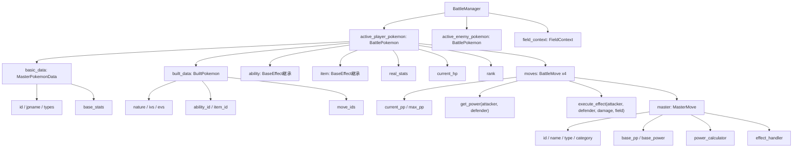
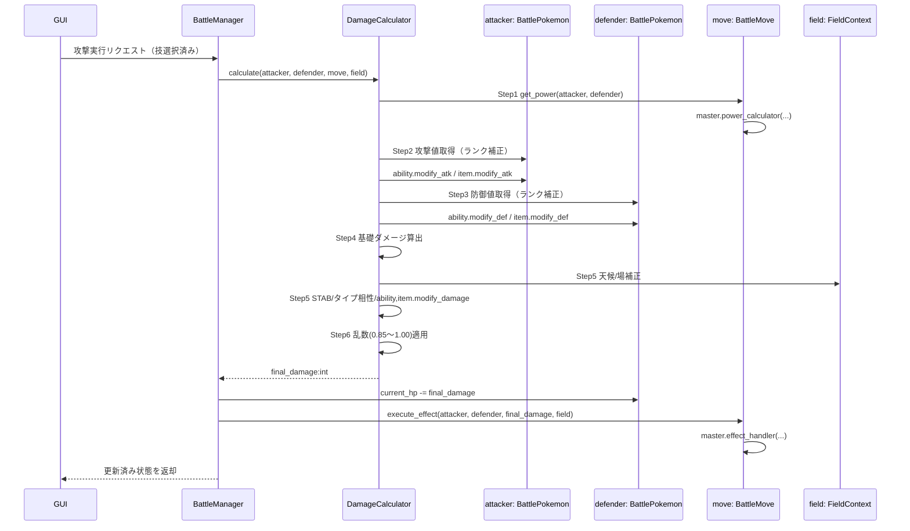

# ポケモンバトル FLOW 設計（データ構造 & ダメージ計算統合版）

本ドキュメントは、バトル時の**データ保持構造**と**ダメージ計算〜反映フロー**を統合した最新仕様です。  
GUIはこのFLOWを唯一の前提として再構築します。

---

## 1. データ保持構造（Data Containment Tree）

### 1.1 構造の要点

- `BattleManager` が戦闘中の全状態を保持するルートコンテナ。
- `BattlePokemon` は `basic_data` と `built_data` を内包し、戦闘中の可変値（`real_stats` / `rank` / `current_hp` / `moves` / `PP` 等）を同時に持つ。
- `BattleMove` は `MasterMove` を参照しつつ、PP等の可変ステートを持つ。
- 特性・持ち物は `BaseEffect` 継承インスタンスとして注入され、各フックで計算へ介入する。

### 1.2 `BattlePokemon` の直接アクセス属性

| アトリビュート名 | 型 / 構造 | 概要・説明 |
| --- | --- | --- |
| `basic_data` | `MasterPokemonData` | 図鑑カタログ・種族の基本データ（固定値） |
| `built_data` | `BuiltPokemon` | 個体差・育成データ（性格、努力値、技等） |
| `real_stats` | `Dict[Stats, int]` | 計算済みのステータス実数値（HP, Atk, Def等） |
| `rank` | `Dict[Stats, int]` | バトル中のステータスランク補正（-6 〜 +6） |

### 1.3 内包データのアクセス経路

#### `basic_data` 経由（`battle_pkm.basic_data.xxx`）

- `id`: ポケモン図鑑ID (`int`)
- `name`: ポケモンの英語名 (`str`)
- `jpname`: ポケモンの日本語名 (`str`)
- `selective_gender`: 種族としての性別傾向 (`enums.Genders`)
- `weight`: 体重 (`int`)
- `height`: 体長・高さ (`int`)
- `base_stats`: 種族値の辞書 (`Dict[Stats, int]`)
- `abilities`: 覚える可能性のある特性IDリスト (`List[int]`)
- `types`: 属性タイプ (`enums.Typeslist`)
- `learnt_moves`: 覚えることができる技IDリスト (`List[int]`)

#### `built_data` 経由（`battle_pkm.built_data.xxx`）

- `id`: 個体/構築ID (`int`)
- `evs`: 努力値の辞書 (`Dict[Stats, int]`)
- `movelist`: 選択された技IDリスト (`List[int]`)
- `gender`: この個体の性別 (`enums.Genders`)
- `nature`: 性格 (`enums.Natures`)
- `itemid`: 所持している持ち物ID (`int`)
- `abilityid`: 選択されている特性ID (`int`)

#### 補足

- `basic_data` は旧来の `master` に相当し、`built_data` は旧来の `build` に相当する。
- `BattlePokemon` 内では、`base_stat` と `evs` のようなプロパティ経由の参照も用意されている。

---

## 2. 計算 & 反映実行フロー（Calculation & Execution Flow）

### 2.1 DamageCalculatorの責務（ステートレス）

入力:
- `attacker: BattlePokemon`
- `defender: BattlePokemon`
- `move: BattleMove`
- `field: FieldContext`

出力:
- `final_damage: int`

責務:
- 計算のみを担当（状態の永続保持はしない）。
- 攻撃・防御・威力・倍率・乱数を合成して最終ダメージを確定する。

---

## 3. GUI再構築の大枠（このFLOW前提）

GUIは「計算ロジックを持たない表示・入力層」として再設計する。

### 3.1 GUIの責務

- 入力: ユーザー操作を `BattleManager` へイベントとして渡す。
- 出力: `BattleManager` が返す最新状態を描画する。
- 非責務: ダメージ式、タイプ相性、特性補正などの計算判断。

### 3.2 推奨イベント駆動モデル

1. GUIで入力変更（ポケモン/努力値/技/天候/場）。
2. GUIは対応する更新APIを `BattleManager` に通知。
3. 攻撃実行時に `BattleManager -> DamageCalculator` を起動。
4. 計算後の状態（HP、ログ、追加効果反映）をGUIに返す。
5. GUIは返却状態をそのまま表示。

### 3.3 画面構成の再整理指針

- **State Panel**: 自分/相手の `BattlePokemon` 現状態（HP・ランク・特性・持ち物）。
- **Action Panel**: 技選択（`BattleMove`）と実行ボタン。
- **Field Panel**: 天候・フィールド・壁など `FieldContext`。
- **Result Panel**: 今回ダメージ、残HP、発動した追加効果。
- **Log Panel（任意）**: ターンごとの処理順と計算要約。

### 3.4 設計上の重要ルール

- GUIは `BattleMove.get_power()` や `modify_atk()` を直接呼ばない。
- 計算結果反映（`defender.current_hp` 減算）は `BattleManager` が一元管理する。
- `effect_handler` 実行後の状態を最終表示対象とする。
- 将来の自動テストは `DamageCalculator` 単体と `BattleManager` 統合で分離して行う。

---

## 4. 最終方針（今回の概念変更）

- データ中心は `BattleManager` 配下のコンテナツリーに統一。
- ダメージ計算は `DamageCalculator` のステートレス実行に統一。
- 技固有処理は `BattleMove -> MasterMove(power_calculator/effect_handler)` に統一。
- GUIはこのFLOWに従う「入力/表示専用層」として再構築する。